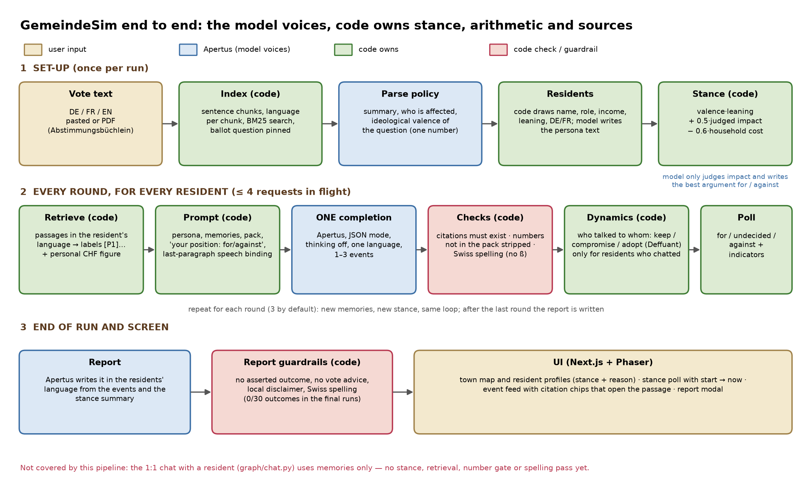

# Briefing for judges and the Apertus team

GemeindeSim is a **generative-agent town** for Swiss civic material. You paste a municipal vote or budget (German and French) or an English economic policy. The app spawns residents on a pixel-art map. Each resident has a language, a household stake, a memory stream, and a social graph. Over a few rounds they talk, move, protest, change prices, and shift mood. A dashboard tracks livelihood indicators. A closing report summarises who was strained and why — **without telling anyone how to vote**.

This note is the shortest path into the project: what it is, why Apertus, how the model is actually called, which papers we are implementing, and where we want expert pushback.

Live captures from a 70B Linden run are in [`screenshots/`](screenshots/).

---

## What we built

A two-service app:

- **Backend:** FastAPI + LangGraph + Socket.IO. Policy ingest (PDF/CSV/notes), closed-corpus retrieval, NPC generation, Park-style cognitive loop, Peralta-style opinion dynamics in code, economic report.
- **Frontend:** Next.js 16 + Phaser 3. Title screen, policy/config graph editor, live map, event log, Egg Index dashboard, end-of-run report.

Default demo: 5 residents, 3 rounds, bilingual **Gemeinde Linden** Steuerfuss / school-credit notes (`data/steuerfuss_linden_{de,fr}.txt`). A second English sample (`data/tariff_millfield_en.txt`) stays available. The engine still supports up to 25 NPCs and 15 rounds.

Five event types are first-class: `chat`, `move`, `protest`, `mood_shift`, `price_change`. Swarm mode (initiator/reactor rounds) is a flag, not a rewrite.

## Use case

Swiss votes and municipal budgets are published in more than one language, with numbers that matter differently to a tenant, a shop owner, and a municipal employee. A single “average opinion” hides that. GemeindeSim is a **closed-corpus explainer**: residents may only quote figures that were retrieved or computed. The report describes livelihood effects and the split in the town. It does not campaign.

That is the intended public-sector use: a Gemeinde, a canton communications team, or a civic-tech group can drop in a booklet they already have the right to process, run a small town, and see where the text lands. The same stack can run on the hackathon gateway today and on local vLLM serving `swiss-ai/Apertus-v1.5-70B` later.

We designed this against the [Apertus Charter](https://www.apertus-ai.org/pages/charter/): cite sources, no partisan side-taking, not legal advice.

## Why Apertus

We are not using Apertus as a generic chat box. We are using it because the problem is **Swiss, multilingual, and sovereign**.

1. **Languages that match the corpus.** Apertus 1.5 is strong on instruction following with thinking *off* (independent 8B IFEval prompt-strict 85.8 in the NLP Lab harness) and has real multilingual gains on Global-MMLU and Belebele. Our default residents speak German or French, one language per completion.
2. **Long context, used carefully.** 262k tokens lets us stuff a booklet *section* when retrieval is ambiguous. We still retrieve first. Stuffing both full booklets into every resident turn washes out the persona and burns latency.
3. **Open weights and a Swiss deploy path.** Track 2B asks for on-prem, air-gapped, or Swiss sovereign cloud. `LLM_BASE_URL` is the only outbound the app needs. The same JSON gate works against the hackathon endpoint and against local vLLM.
4. **Honest about mid-pack factual recall.** MMLU-Pro / GPQA numbers are not a reason to let the model be the encyclopedia. Facts live in the corpus and a calculator. The model is a reader and a speaker.

We split every request into **one mode**. Apertus 1.5 documents that **thinking and tools are mutually exclusive**; the vLLM thinking recipe omits auto tool choice on purpose. Our probe of the Hack Apertus gateway confirmed that, and also that **native parallel `tool_calls` fail** (one structured call, the rest dropped or faked as text). See [`PROBE-AND-PLAN.md`](PROBE-AND-PLAN.md).

## How we use Apertus

Default model: **`apertus-v1.5-70b`** at `temperature: 0`. The 8B is a fallback on overflow / long queues, same schema, shorter `max_tokens`.

| Mode | Thinking | Tools | `response_format` | Used for |
| --- | --- | --- | --- | --- |
| `json` | off | none | `json_object` | Policy parse, personas, resident turns, economic report |
| `tool_one` | off | exactly one function, `tool_choice` forced | none | A lookup the *code* already chose |
| `think` | on | none | none | Hard explanation only; never shown raw |

Implementation lives in `src/backend/graph/llm.py`:

- An **example JSON instance** in the prompt (not a JSON Schema dump — the model echoes schemas). Measured (research E2/E2b, 49 real prompts): a placeholder example (`"..."`, `0`) is echoed; a *filled* example is parroted (8B copied 53 % of its dialogue); **instruction placeholders** (`<what you do, one sentence>`) gave 0 % copying. The example also sets the event mix, so we choose it on purpose.
- Strip `<|inner_prefix|>…<|inner_suffix|>` (and `<think>`) so reasoning never reaches the UI.
- Balanced-object scan, trailing-comma strip, Pydantic validate, **one repair call**, then a deterministic in-character fallback so a round cannot stall.
- **Semaphore** (`LLM_CONCURRENCY`, default **4**) around completions. Parallelism is many requests, not one message with many tools. The gateway answers HTTP 429 above ≈ 4 requests in flight (research E10); on 429 we back off and retry the *same* model (the earlier code silently switched to the 8B, which collapses event diversity).

LangGraph nodes:

1. `parse_policy` — retrieve, then structured `PolicyAnalysis` (sectors, stakeholders, impacts, controversy, `situation_kind`).
2. `generate_npcs` — Swiss name pools, frozen Gemeinde roles, interview-style `life_story`, `lang` ∈ {de, fr, en}.
3. `run_round` — Park retrieve → reflect → plan → act. Optional swarm orchestrator scores initiators in **code**.
4. `economic_report` — 70B narrative over aggregates the simulator already computed. Vote advice is stripped.

Prompts are XML-tagged, one language per system line, with a short official-term glossary (Vorlage / objet, Steuerfuss / taux d’imposition, Gemeinderat / conseil communal). Cross-language chat is a **separate translation hop**, not “answer in both languages.”

## Agents, tools, and what is *not* the model

**Agents.** Each NPC is a Park 2023 generative agent: memory stream, recency-weighted retrieval, periodic reflection, a short plan, then 1–3 typed events. We are not claiming multi-day open-world play. We are claiming the same cognitive loop on a short civic run.

**Tools.** We do **not** let the model fan out tools. Retrieval is a Python function on a closed lexical corpus (`graph/corpus.py`). If we ever expose a single tool, `tool_choice` is forced to that name. A planner that needs three lookups returns JSON `{"steps": [...]}`; the executor runs those lookups in code.

**Stance (code, not LLM).** Each resident has a `stance ∈ [−1, 1]` on the question, computed once in code from the measure's ideological valence × the resident's leaning, the model's judged household impact and a *computed* cost (a small calculator reads the booklet's worked example and scales it by income band). Apertus writes the best argument for and against, in the resident's language; the code decides which one the resident holds. Why: asked directly, Apertus 1.5 answers *yes* for every resident (15/15, also with no persona and with a balanced corpus; research E11/E11c) and, re-asked at the end with the resident's own memories, turns 3 of 4 opponents into "yes" (E13).

**Opinion dynamics (code, not LLM).** After chats, we apply Deffuant bounded confidence to the stance, Baumann controversy drift (only for residents who actually conversed — the earlier global drift polarised a *silent* town, E4) and keep/compromise/adopt from Chacoma & Zanette (via Peralta et al. 2022). Influence uses relationship type × strength. Chat radius is Chebyshev distance ≤ 2. The model does not update stance or `political_leaning` by fiat.

**Dashboard math (code).** Egg Index, prices, unemployment, unrest, approval — computed from events, not generated as prose numbers.

This split is the core product claim: **Apertus narrates one grounded step; the application decides, retrieves, computes, and checks.**

## What we measured (5 October; full record in [`research/`](research/README.md))

We used the town as a test bench for the model. Every number is from a logged run (`track_2b/research/`).

| Finding | Evidence |
| --- | --- |
| Native parallel tool calls fail; forcing `tool_choice="required"` does not help; the 70B emits the second call as *text* | 11/11 trials per model (E1) |
| Thinking + `json_object` silently skips the reasoning (the 70B then answers a trap puzzle wrongly in 15 tokens); tools + thinking is accepted but shows no reasoning | E1 |
| `temperature: 0` is not reproducible | 5 identical prompts → 3 (70B) / 5 (8B) distinct outputs (E1) |
| The hosted gateway tolerates **4** requests in flight (advertised 5); beyond that 429 | E10 |
| German/French fidelity is excellent: every utterance stayed in the resident's language | 112/112 events (E3) |
| Swiss civic knowledge is weak: both sizes define *Steuerfuss* as a rate on income and fail 4 000 × 6 % | 70B 12/15, 8B 9/15 (E7) |
| Asked for a stance, every resident says **yes**, whatever the persona (also none, also with a balanced booklet) | 15/15 (E11, E11c) |
| On 54 real federal votes the simulated electorate is 34–37 points too favourable; persona detail adds little; the 8B follows an official recommendation 98 % of the time; German prompts are 19 points more favourable than French | E8 (3 672 calls) |
| Residents' *speech* leaned worried/against even though direct questioning says yes; the stance line controlled speech only for opponents. A reminder as the last prompt paragraph, plus a two-sided instruction for undecided residents, raised speech–stance agreement from ≈ 0.5 to **0.88–0.91 (70B) / 0.85–0.87 (8B)** on the final code, on both graphs, at no measurable cost | E14, E15, E16b, final runs |
| On a real 48-page Federal Council booklet the 70B answers 12/14 questions correctly (hand-graded), abstains on all 3 unanswerable ones; retrieval (11/14 recall@4) is the bottleneck, not the model | E17 |
| `make run` could not build from a clean checkout in the original repo (no Linux native packages in either frontend lockfile); fixed and verified from a fresh clone | E18 |
| The model never gave explicit vote advice (0/30) but, with the old prompt, asserted an invented outcome ("the measure passed") in most reports | E9; fixed 12/30 → 0/30 (E9b) |
| Citations were decorative (0 of 159 ids existed) and are now validated (100 % of labels valid in all 16 final runs) | E3, final runs |
| A second hosted endpoint (the CSCS inference API, 6 Oct) lifts the speed limits (no 429 up to 96 requests in flight; the same simulation 126 s → 61 s on the 70B) and every v2 fix replicates; the yes-bias, the single tool call, the non-reproducible `temperature 0` and the real-vote result do not change | E20–E28, [`research/07-cscs-vs-livemap.md`](research/07-cscs-vs-livemap.md) |
| The 1:1 chat with a resident is grounded like a round: answers first, cites passages, strips figures outside the text, declines unknown facts (5/5), never recommends a vote (0/5); with the whole booklet in its prompt the real-booklet revenue question is answered 5/5 instead of 0/5 | E25, E28 |

**What this changes in how we describe the product.** GemeindeSim is a bilingual, grounded *what-if explainer*, not a
vote predictor, and not a source of Swiss facts. Apertus is the speaker; the application owns stance, arithmetic
and sources. Corrections to earlier statements in this repo are listed in
[`research/04-pitch-audit.md`](research/04-pitch-audit.md).

**For the Apertus team** (things we could not resolve from outside): is the silent skipping of reasoning under
`json_object` the intended vLLM behaviour? Is the 4-in-flight limit a gateway or a deployment property (the CSCS API showed none up to 96)? Would a
`reasoning` field be exposed (our splitter already no-ops)? Is the strong *yes* default on civic proposals a known
effect of the charter alignment?

## Innovation we want reviewed

These are the pieces we would most like judges and the Apertus core team to stress-test.

1. **Split-mode recipe for Apertus 1.5.** `json` / `tool_one` / `think` never mixed. Is this the intended production pattern, or should json+thinking be first-class on the gateway?
2. **No native parallel `tool_calls`.** Consistent on this endpoint at temperature 0. Model limit, vLLM recipe, or gateway parsing? We designed the whole round loop around the failure.
3. **Thinking spans remaining in `content`.** We strip `<|inner_prefix|>`. If a later stack exposes a `reasoning` field, our splitter should no-op. Is that the roadmap?
4. **Example-instance prompting vs schema dumps (APO-lite).** We follow the automatic-prompt-optimization literature only as far as: filled example, closed enums, repair from the validator error. Worth a real APO loop, or is the gate enough at 70B?
5. **Closed-corpus RAG vs stuffing 262k.** We retrieve first. When should we put a full booklet section in the prompt?
6. **Code-side social physics.** Opinion updates are equations, not “please become more left-wing.” Does that match how you want agents evaluated, or should stance stay entirely in the LLM?
7. **Charter behaviour.** Reports are written to describe tradeoffs and must not recommend a vote. Live Linden run did this. Where is the line if a resident is an activist?
8. **70B vs 8B for resident turns.** 70B is the shown voice; 8B is overflow. Independent 8B IFEval is strong with thinking off. Should a production Gemeinde default to 8B locally and 70B only for the report?
9. **One completion, one language.** We refuse “answer in DE and FR in one sample.” Is that overly strict given the multilingual pretraining, or the right way to keep Swiss administrative register?

## Research we are implementing (and stretching)

| Paper | What we take | What we change |
| --- | --- | --- |
| Park, O’Brien, Cai, Morris, Liang, Bernstein (2023). *Generative Agents: Interactive Simulacra of Human Behavior.* arXiv:2304.03442 | Memory stream, retrieve → reflect → plan → act | Short civic run, 5–25 agents, typed economic events, JSON gate |
| Park et al. (2024). *Generative Agent Simulations of 1,000 People.* arXiv:2411.10109 | Interview-style persona grounding | Frozen role + `life_story` from names/policy, not 1,000 real interviews |
| Peralta, Kertész, Iñiguez (2022). *Opinion dynamics in social networks: From models to data.* arXiv:2201.01322 | Deffuant, Baumann, influence | Applied after chat events in Python, not sampled by the LLM |
| Chacoma & Zanette (2015), via Peralta §3.3 | Keep / compromise / adopt | Thresholds on `I_ij` from relationship type |
| Ramnath et al. (2025). *A Survey on Automatic Prompt Optimization.* arXiv:2502.16923 | Repair from validator signal | One repair pass, not a search over prompts |
| Apertus 1.5 docs / NLP Lab getting-started (2026) | json mode, thinking flag, tool protocol | Probe-backed ban on parallel tools; inner-span strip |
| [Apertus Charter](https://www.apertus-ai.org/pages/charter/); [data transparency](https://github.com/swiss-ai/apertus-data-transparency) | Cite, don’t campaign | Report sanitizer; closed corpus; no open-web RAG |

Architecture sketch: [`ARCHITECTURE.md`](ARCHITECTURE.md). Eval fixtures: `src/backend/tests/test_apertus_gate.py`, `test_eval_schema.py` (offline schema 20/20). Live 70B Linden run: PolicyAnalysis in ~13s, 5 NPCs with DE/FR chat on the map, 3 rounds, economic report with no vote advice.

## How this tries to advance Apertus

Apertus is already a strong **single-turn** instruction model. Civic Switzerland is a **multi-agent, multilingual, source-constrained** problem. GemeindeSim is a test harness for that combination:

- Many structured 70B completions per round, coordinated by LangGraph, not one mega-prompt.
- German and French as *resident languages*, not as a translation afterthought.
- A reproducible gate (example JSON, repair, fallback, semaphore) that other Apertus apps can copy.
- A deploy story that does not require a US-hosted frontier API: swap `LLM_BASE_URL` to CSCS / on-prem vLLM.
- Empirical notes on this gateway’s tool and thinking behaviour, so the core team has a product-shaped failure case rather than a chatbot anecdote.

We are not fine-tuning for the prototype. If the gate is the right abstraction, the same app should get better when 1.5 weights or decoding improve — without us rewriting the town.

## Language help — a personal note

I am not a native speaker of German or French. For the Linden sample, glossaries, and a lot of the in-character lines, I am genuinely using machine translation and then checking against official-looking phrasing. That is a real weakness for a Swiss civic demo.

If you speak the administrative register — DE, FR, or Italian — and you are willing to correct resident voice, glossary terms, or the booklet tone, I would be grateful. Issues and PRs on this repo are welcome. The simulation is only as honest as the language the residents speak.

---

Further reading: [`PROBE-AND-PLAN.md`](PROBE-AND-PLAN.md) (endpoint probe tables), [`HACKATHON.md`](HACKATHON.md) (submission mechanics), `../technical_report.md`.
