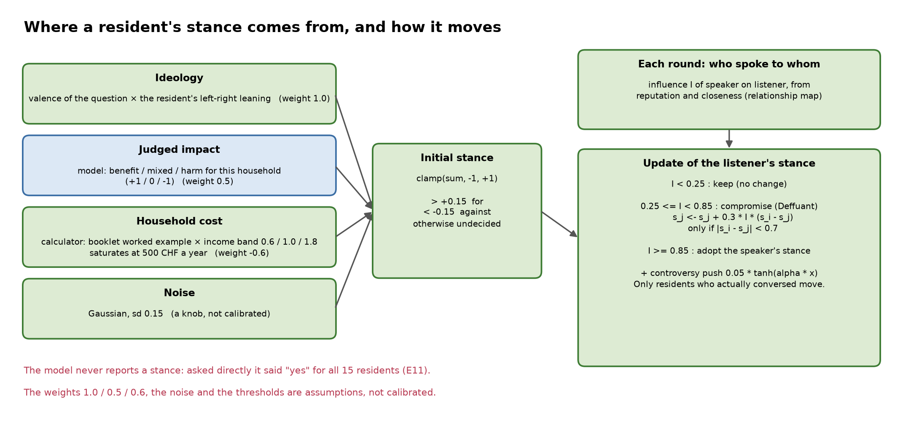
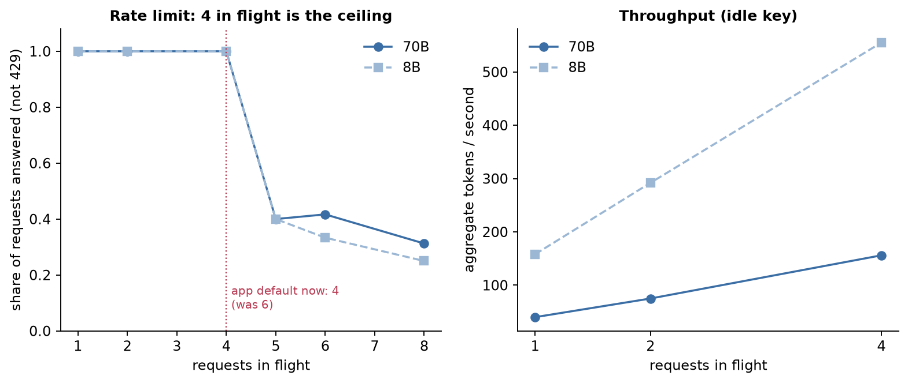
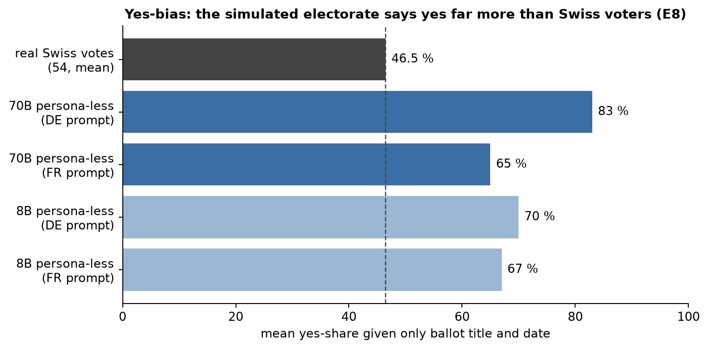
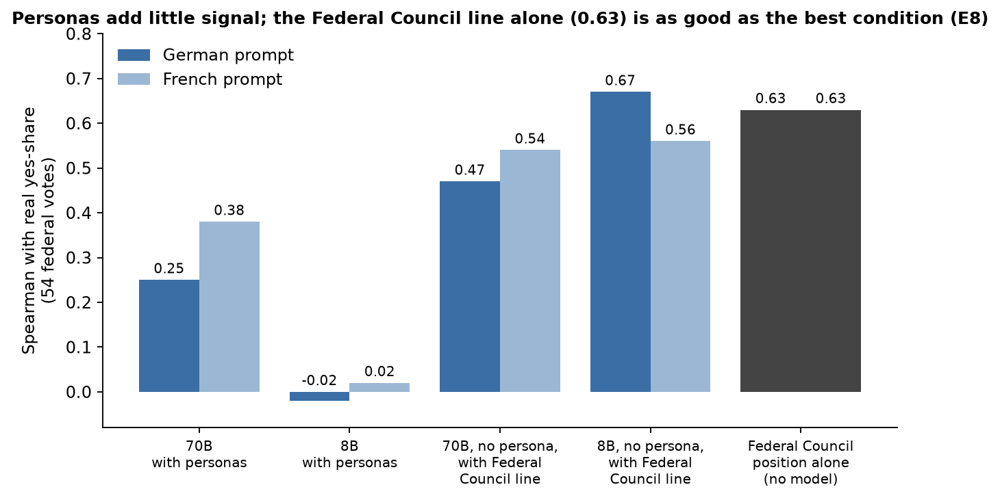
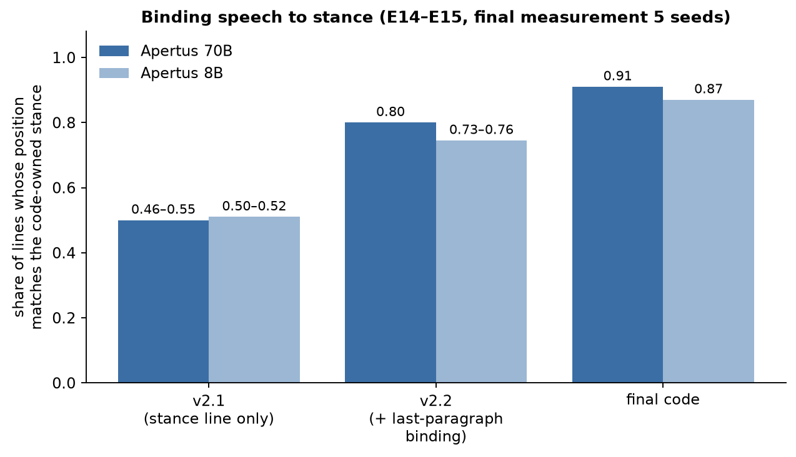
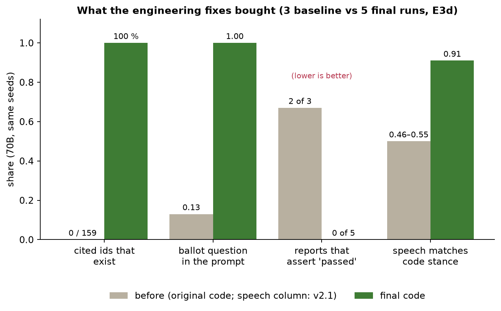
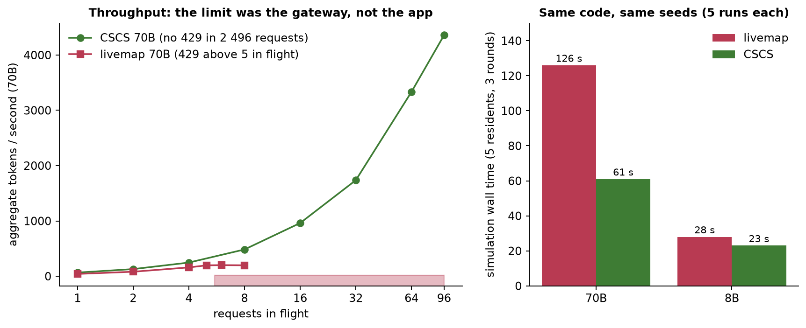

# GemeindeSim — the complete project brief for the mentor meeting

*Hack Apertus 2026, Track 2B (own project). State: 7 October 2026, branch `main` (updated after a second inference endpoint, CSCS, became available: 4.8; and after the mentor's engineering questions: 4.9).
This document is written to be read on its own: parts 1–4 explain the whole project, part 5 lists what we want to discuss — each topic is
followed immediately by **our current solution**, so the mentor sees what we already do before we ask.*

*Every number comes from a logged run in `track_2b/research/results/` and is tabulated in [`research/03-results.md`](research/03-results.md);
the chronological record including failures is [`research/LAB-NOTEBOOK.md`](research/LAB-NOTEBOOK.md). "Likely mentor view" lines are our
own expectation, **not** something a mentor has said.*

**Contents**

1. [The project in five minutes](#1-the-project-in-five-minutes)
2. [How we got here: development history](#2-how-we-got-here-development-history)
3. [How the app works today](#3-how-the-app-works-today)
4. [What we measured](#4-what-we-measured)
5. [Topics to discuss with the mentor](#5-topics-to-discuss-with-the-mentor) (agenda in 5.0; the nine planned questions in 5.1; seven new ones in 5.2)
6. [What we claim and what we do not](#6-what-we-claim-and-what-we-do-not)
7. [Questions the mentor may ask us](#7-questions-the-mentor-may-ask-us)
8. [Open items, reproduction, glossary](#8-open-items-reproduction-glossary)

---

## 1. The project in five minutes

### What it is
GemeindeSim is a **generative-agent town for Swiss civic material**. You paste the text of a municipal vote (German and/or French; a PDF
booklet works too). The app creates a small town of residents — a tenant, a shop owner, a retiree, a teacher, a municipal employee, an activist, … — each with a persona, an
income, a left–right leaning and a language (German or French). Over a few rounds the residents talk to each other, quote the vote text, change
mood, and move; the screen shows a pixel-art town, a live **stance poll** (for / undecided / against), an event feed in which every quoted sentence
links back to the passage of the vote text it came from, and at the end a **report** that describes who is affected and why.

It runs on **Apertus 1.5** (Swiss open LLM; the 70B and 8B on the hackathon gateway) and is meant for a municipality, a canton communications team or a civic-tech group
that wants to *see where a text lands* before it is voted on — a **what-if explainer**, not a forecast.

### The one idea
> **The model voices; code owns stance, arithmetic and sources.**

We measured that Apertus, asked how a resident would vote, says **"yes" for every resident** (15 of 15, with any persona and with no persona at all) and that a simulated electorate is
about 35 percentage points too "yes" on 54 real Swiss votes. So the app does **not** let the model decide what a resident thinks.
Code computes each resident's stance from ideology, the model's *judgement of impact on the household* and a **computed household cost**; code retrieves the passages,
validates every citation, strips numbers that are not in the sources, and updates opinions with a published model (Deffuant bounded confidence). The model gives the residents
their voice — and writes the report.


### What we found (headline results)
| area | result |
| --- | --- |
| Our own code vs. the original pitch | many claims did not hold: 0 of 159 cited source ids existed, no calculator existed, a silent town polarised on its own, reports invented outcomes — all measured, all fixed ([4.4](#44-engineering-defects-measured-and-fixed)) |
| Apertus limits in an agent loop | no parallel tool calls, thinking and JSON exclusive on this gateway, `temperature 0` not reproducible, 4 requests in flight, strong DE/FR fidelity, needle recall to ≈105k tokens ([4.1](#41-capabilities-and-limits-of-apertus-15-on-the-gateway)) |
| Population validity | strong yes-bias; personas add little; the Federal Council position alone is as good as the best LLM condition ([4.2](#42-is-the-population-a-population)) |
| After the fixes (70B, same seeds) | valid citations 0 → 100 %, speech matches stance ≈ 0.5 → 0.91, reports asserting an outcome 2/3 → 0/5 |
| Real booklet | 48-page Federal Council booklet: right passage in the top 4 for 11 of 14 questions, grounded answers 12/14, 3/3 correct abstentions; with the whole booklet in the prompt the 70B answers 13/14 (4.8) |
| Second endpoint (CSCS, 6 Oct) | no 429 up to 96 requests in flight (livemap: ≈ 4–5), the same simulation takes 61 s instead of 126 s, every v2 fix replicates; the yes-bias, the single tool call and the non-reproducible `temperature 0` do not change ([4.8](#48-a-second-endpoint-the-cscs-inference-api)) |

### What it is **not**
Not a vote predictor, not legal advice, not campaigning. It does not recommend a vote (guardrail checked 0/30). We have **not** tested a local/on-prem deployment (no GPU); the
findings are properties of two hosted deployments (the hackathon gateway "livemap" and the CSCS inference API, 4.8).

### Run it
`cp track_2b/.env.example track_2b/.env` (set `LLM_API_KEY`), then `make run` from the repository root → http://localhost:3000 (also :8080, or `UI_ALT_PORT`), API http://localhost:8000/docs.
Sample texts: `data/steuerfuss_linden_{de,fr}.txt` (fictional Gemeinde Linden: tax multiplier 118 % → 124 % and a 4.8 million CHF school credit),
`data/steuerfuss_linden_balanced_*.txt` (adds the committee's counter-arguments), `data/tariff_millfield_en.txt` (the original English tariff scenario).

### Screens
Live captures from a 70B run are in [`screenshots/`](screenshots/) (`06-simulate-live.png` shows the stance panel and the event feed with citation chips; `07-economic-report.png` the report).

---

## 2. How we got here: development history

### 2.1 The starting point
The repository began as a **US-economy policy simulator**: paste an English policy (the demo was a 25 % steel tariff in the fictional town of Millfield), spawn residents on a pixel map, watch prices, protests,
moods and conversations unfold, and read an economic report; the dashboard tracked an "Egg Index", prices, unrest and approval. The engine was a Park-et-al.-style generative-agent loop (memory, mood, plans) on
LangGraph, with a FastAPI/Socket.IO backend and a Next.js/Phaser frontend. For Hack Apertus the pitch was re-targeted to **Swiss votes**: German/French residents in Gemeinde Linden, retrieval from the official text,
a household calculator, sources cited, no vote advice, and a "limits of Apertus" probe.

### 2.2 What changed in this work (chronological)
| step | what we did | outcome |
| --- | --- | --- |
| 1. Audit before experiments | read the whole code and the pitch; wrote hypotheses *before* testing (`02-codebase-audit.md`); read ≈55 papers (`01-literature-review.md`) | a list of testable claims (`04-pitch-audit.md`: 11 about the model, 12 about the app) |
| 2. Baselines | instrumented full runs (3× 70B, 2× 8B) with every gateway call logged in full | the app's own defects became visible (2.3) |
| 3. Apertus probes | tool calls, thinking, JSON, determinism, throughput, structured output, Swiss knowledge, language fidelity, report behaviour, long context | the limits table (4.1) |
| 4. "Will residents always say yes?" | asked directly, with and without persona, with a balanced text | 15/15 yes → the stance must come from code |
| 5. Real-world check | 54 real federal votes 2021–2026 (Swissvotes, Univ. Bern) | ≈ 35 pp too yes; persona detail adds little |
| 6. v2 build | stance module, calculator, new retrieval, citation validation, number gate, report guardrails, speech binding, UI stance panel | before/after on identical seeds (4.4) |
| 7. Hard cases | undecided residents; real 48-page booklet; compare-conditions harness | 4.3, 4.6, 4.7 |
| 8. Deployment | the original `make run` **did not build from a clean clone** (lockfiles lacked Linux packages); compose defaults overrode our fixes; a silent HTTP 422 for texts > 4 000 characters | all fixed and verified from a fresh clone and through the real UI |
| 9. Submission | judge briefing, technical report, 3-page PDF, demo script, native-speaker review pack (49 items), 120 offline tests, public repo | see part 8 |
| 10. Second endpoint (6 Oct) | a key for the CSCS inference API: same probes, same scripts, same-day controls on livemap (E20–E28); then wired what it makes affordable: the grounded 1:1 chat, a 5-run spread in the app, replays that carry the report | 4.8 |

### 2.3 What we found wrong in our own code (not model problems)
* **Citations were fiction:** 0 of 159 cited source ids existed in the corpus (5 runs). The "grounded" flag was true whenever no unknown number appeared.
* **Retrieval:** the ballot question reached the resident's prompt in 4 of 15 cases (27 %); the language filter did nothing (every chunk tagged `de`); chunks were cut mid-word.
* **The calculator did not exist**, although the docs promised it; the 70B computed 4 000 CHF × 6 % as 280 (correct: 240).
* **A silent town polarised on its own:** mean |leaning| 0.51 → 0.69 in 15 rounds with **zero** conversations, because the Baumann drift ran for everyone every round.
* **Reports:** said the measure "passed" in at least 12 of 30 samples and mixed German with an English disclaimer (they never gave vote advice).
* **Plumbing:** `influence_events` was silently dropped by LangGraph state (empty in all baseline runs); concurrency default 6 exceeded the gateway's 4; a 429 silently swapped the model to the 8B;
  `price_pressure` is always 0 for a tax vote.
* **Our own measurement errors** (kept in the notebook): the first throughput run was contaminated by two jobs sharing one key; the self-introduction metric ran case-insensitively and flagged
  "Ich bin noch unentschieden" (correction C1); an automatic grader undercounted the booklet QA (7/14 vs 11/14 by hand); a "derived arithmetic" number-gate variant made things worse (removed).

### 2.4 What stayed from the original
The Park-style town (memory, mood, plans, five event types), the LangGraph + Socket.IO + Phaser stack, the policy editor, and the English tariff mode (Millfield, economy bars). What is new is the **domain**
(Swiss vote), the **central output** (stance poll instead of an economic dashboard) and the **mechanisms** (code-owned stance, grounding, guardrails).

---

## 3. How the app works today

### 3.1 Architecture in one picture
Two Docker services: **backend** (FastAPI, LangGraph, Socket.IO, port 8000) and **frontend** (Next.js 16 + Phaser 3, port 3000). The only outbound network call is to `LLM_BASE_URL`
(OpenAI-compatible; the hackathon gateway now, a local vLLM later). The LangGraph graph is `build_context → parse_policy → generate_npcs → run_round` (repeated per round);
a *swarm* variant (initiator/reactor rounds) exists, is measured, and is **off by default** (+27 % time, no quality gain).

Colour key for both figures: **blue = Apertus voices it, green = code owns it, red = code check or guardrail, sand = user input / screen.**

### 3.2 Set-up (once per run)
1. **Input.** The user pastes text (or uploads a PDF/CSV); defaults are 5 residents and 3 rounds (max 25 residents). `build_context` chunks the sources
   (`graph/corpus.py`): sentence-aware chunks, a language tag per chunk, a BM25 index with accent folding and 6-character stems, chunks containing the ballot question flagged `is_question`.
2. **Parse the policy** (`parse_policy`, model, JSON): summary, affected sectors and stakeholders, controversy level, situation kind (vote / budget / shock) and **`ideological_valence`** — one number saying
   whether the question is left- or right-coded.
3. **Create residents** (`graph/nodes/npc_orchestrator.py`): the setting is detected from the text (Swiss → town *Linden*, German/French split; US → *Millfield*, English). Named people in the text are extracted
   (a literal-name filter drops invented names); the rest are **random bases drawn by code** — name from German or French name pools, gender, MBTI, income band, left–right leaning (uniform −1…1), position, mood,
   and a **role taken round-robin from a fixed list** (tenant, shopkeeper, farmer, teacher, municipal employee, retiree, worker, business owner, politician, activist). The model then writes bio, persona, beliefs
   and life story; a Swiss-vocabulary pass fixes ß and Germanisms. *The town is generated at run time; roles, name pools and the formula are predefined, so the same seed gives the same attributes but different persona text.*
4. **Stance** (`graph/nodes/stance.py`, figure 2 below): for each resident the model sees the household's three best retrieved passages and returns only
   `impact` ∈ {benefit, mixed, harm, none} plus the strongest argument *for* and *against* in the resident's language. Code then computes `stance = 1.0 · valence · leaning + 0.5 · impact + (−0.6) · burden + noise (sd 0.15)`, clamped to [−1, +1],
   where `impact` is +1 / 0 / −1 and `burden` is the **calculator's** yearly extra tax for this household (the booklet's worked example, scaled by the income band 0.6 / 1.0 / 1.8) divided by 500 CHF and capped at 1.
   Above +0.15 is *for*, below −0.15 *against*, otherwise *undecided*. The weights are **knobs, not calibrated constants.**
5. **Relationships:** affinity and trust from a heuristic plus a model-assisted pass; used for who talks to whom and for influence.



### 3.3 Every round, for every resident
Residents are processed concurrently, at most **4 requests in flight** (`LLM_CONCURRENCY`; the gateway answers HTTP 429 above that).

1. **Retrieve** in the resident's language: the pinned ballot-question chunk(s) (up to two) plus the BM25 top-k (4 for a short text, 6 for a large one). Passages are labelled **[P1], [P2], …** and
   a **personal line** with the resident's own CHF figure from the calculator is added to the pack.
2. **Memories** (Park 2023): retrieval by recency, importance and relevance; periodic reflection and a current plan.
3. **Prompt** (`graph/prompts.py`): persona, nearby residents (with ids), memories, the pack, the line *"your position on the question: for/against/undecided (±x), your reason: …"* and, as the **last paragraph**,
   a reminder that binds the resident's *speech* to that stance. For an *undecided* resident the reminder is two-sided: state plainly that you are undecided, give one concrete reason for and one against, never only costs,
   and "do not repeat the sentences above word for word".
4. **One completion** (`graph/llm.py`): Apertus, **json mode** (`response_format=json_object`), thinking **off**, one language, 1–3 events out of `chat`, `move`, `protest`, `mood_shift`, `price_change`; the prompt contains a
   *placeholder example* (`<instruction>` fields, three events), not a schema.
5. **Code checks** on the answer: every cited id must be one of the resident's labels (invalid ones are dropped and the line is shown as "uncited"); a **numeral gate** removes numbers that are not in the pack
   or computed (normalised numbers, list indices ignored); Swiss spelling (ß → ss) and Swiss terms; `translated_dialogue` for display in the other language. One retry on bad JSON; a deterministic in-character fallback so a round never stalls.
6. **Opinion dynamics** (`run_round.py`): for every conversation the speaker's *influence* I on the listener is computed from reputation and relationship. **I < 0.25: keep** (no change). **0.25 ≤ I < 0.85: compromise** —
   Deffuant bounded confidence, `s_j ← s_j + 0.3 · I · (s_i − s_j)` only if the two stances are within 0.7 (on a 0–1 scale). **I ≥ 0.85: adopt** the speaker's stance. A small Baumann controversy push applies, and
   **only residents who actually conversed move** (the original "everyone drifts" bug was the polarisation artifact).
7. **Indicators and poll:** for a vote, `policy_approval` is the stance poll; the poll counts (for / undecided / against), mean and spread are sent to the UI after every round.

### 3.4 End of run: the report
`services/economic_report.py` asks the model for a report **in the residents' language** (headline, summary, livelihood impact, top impacts, key stats, notable events), with the initial and final stance summary in
the prompt and the instruction that the vote has not happened. Code then enforces the guardrails: **no asserted outcome** (sentence-level removal of "the measure passed/failed" style statements in German, French and English), **no vote advice**,
a localised disclaimer, Swiss spelling. Result: asserted outcome in at least 12 of 30 samples → 0 of 30; language mixing → none.

### 3.5 The screen (frontend)
Landing page → policy/config editor (a node graph; a **record** toggle saves the run) → simulation screen: Phaser town map with residents; **stance poll panel** (for / undecided / against, start → now);
**event feed** with citation chips that open the quoted passage; **resident profile** with stance, reason and impact; **report** modal with the stance shift; replay loader for saved runs (recordings made after 6 Oct also carry the report). Economy bars are hidden for votes and shown for the tariff mode.
The **1:1 chat** with a resident is grounded the same way as a round (since 6 Oct, see 3.7): the answer comes first, the resident's stance and reason colour it, passages of the vote text are cited as chips,
figures outside the text are stripped, "not in the text" is said when it is not, and the reply can be shown translated into the user's language. A collapsible **"Run metrics"** panel shows what the run cost (tokens in and out, share served from the endpoint's cache, context use as a share of the window, latency, requests in flight, retries). The chat answer arrives **sentence by sentence**, each sentence checked before it is sent. A **"Run 5×: show the spread"** button on the Run node
starts the same vote five times and opens a page with the stance poll of every run and its range.

### 3.6 Configuration and deployment
Environment: `LLM_NAME`, `LLM_BASE_URL`, `LLM_API_KEY` (the defaults are the CSCS values, the endpoint the judges use; the hackathon gateway works too: model ids are mapped, `docs/ENDPOINTS.md`), `LLM_CONCURRENCY` (default `auto`: adapts to the endpoint), `LLM_VOICE_NAME` (optional: a different model for the report and
the chat), `CHAT_STUFF_MAX_CHARS` (default 100 000), `SWARM` (default false), `LLM_TEMPERATURE`. `docker compose` builds both services (Node 22, `npm install --legacy-peer-deps`).
Sovereign story: point `LLM_BASE_URL` at a local `vllm serve` of Apertus (air-gapped: no other outbound traffic) or a Swiss cloud endpoint. `research/probe_endpoint.py` measures the same limits on any endpoint.
**We have only measured the hosted gateway.**

### 3.7 Known gaps (state them before they are found)
* **The 1:1 chat was not covered by v2 on 5 Oct** (memories only: no stance, no retrieval, no numeral gate, no Swiss spelling). **Fixed on 6 Oct** and tested live (E25): residents answer first and cite passages,
  decline unknown facts (5/5), never recommend a vote (0/5), do not invent figures. Remaining: facts the model takes from the complete text (documents between 6 000 and 100 000 characters are put in the prompt whole) carry no passage chip.
* Stance weights, noise, thresholds and the role mix are assumptions, not calibrated. LLM-generated personas are homogeneous.
* Dynamics move little in 3 rounds: the poll is unchanged in 4 of 5 final 70B runs; the spread between seeds is large (share *for* 0.00–0.80).
* The model alone agrees with the code stance only 0.64 (7 of 10 code-*against* residents turn "undecided" or "yes" if the model answers alone) — the reason for code ownership, and the point a critic will press.
* The 8B never emits `move`; undecided residents remain weak on the 8B (0.54 vs 0.73 on the 70B).
* The numeral gate misses derived arithmetic ("240 / 12 = 20") and spelled-out numbers; `invoke_llm_think` is unused; German/French register has not been native-reviewed (pack ready).
* Not tested: Italian, Swiss-German dialect, audio, tool calling inside the round loop, any local/GPU deployment, the French booklet.

---

## 4. What we measured

All on the Hack Apertus gateway (`vllm-0.23.1rc1…-tp2`), `apertus-v1.5-70b` and `-8b`, 5 October 2026. Temperature 0 unless stated. One run is an anecdote: counts are given with n.

### 4.1 Capabilities and limits of Apertus 1.5 on the gateway
| area | finding (n) |
| --- | --- |
| Tool calls | one `tool_calls` entry per request. Asked for two: the 70B (11/11) writes two pseudo-calls as **text** with no `tool_calls`; the 8B emits one; `tool_choice=required` also gives one |
| Thinking | accepted together with tools (22/22), but the reasoning span appears in `content` as `<\|inner_prefix\|>…` with the `reasoning` field null (8/8); we strip it |
| Thinking + JSON | `response_format=json_object` makes the reasoning vanish (16/16); bat-and-ball answered 0.10 in 15 tokens. Thinking alone: 70B 6/8 right (2 truncated at 900 tokens), 8B 8/8 at 266 tokens |
| Determinism | `T=0`, same long prompt ×5: 70B 3 distinct outputs, 8B 5 |
| Concurrency | clean up to 4 in flight; 5 in flight → 4 of 10 succeed (429); advertised 5 |
| Structured output | filled examples get **parroted** (70B 16 %, 8B 53 %); a placeholder gives one event per turn on the 8B; our `<instruction>` 3-event example fixes both (valid 100 %, parroted 0 %) |
| Language | 100 % of 112 utterances in the resident's language; DE↔FR translation fluent |
| Swiss knowledge | 12/15 (70B), 9/15 (8B); both define *Steuerfuss* wrongly (it is a multiplier on the simple tax) and get 4 000 × 6 % wrong; both abstain correctly on missing premises; ß in Swiss German (6.3 per run in the baseline) |
| Long context | single-needle recall 60/60 up to ≈105k tokens; latency 70B 1.5–8 s up to 22k, 13–20 s at 50k, 31–36 s at 100k. **Not tested:** multi-fact reasoning, persona dilution, anything beyond 105k (the advertised 262k) |
| Bias | asked directly: yes for every persona; ≈ 35 pp too yes on real votes; the language of the prompt moves the stance ≈ 19 pp (70B) |
| Authority | the 8B follows a shown Federal Council recommendation 98 % (42 % without it); the 70B 83 % (62 % without) |



### 4.2 Is the population a population?
**Asked directly (E11, 15 residents):** full persona, role + income only, no persona at all, balanced text — **15/15 yes** in every condition (14 + 1 failed call with the balanced text; at T=0.7: 27 yes, 2 no).
This is a model property, not a corpus artefact.

**Against 54 real Swiss federal votes (E8, 3 672 calls):** real mean yes-share 46.5 %.





Persona detail adds little (Spearman 0.25–0.38 for the 70B with personas, ≈ 0 for the 8B) and adding left–right self-placement removes it. The Federal Council position alone scores direction 0.75 and Spearman 0.63;
the only condition that matches it is the 8B *shown* the recommendation (0.67), which is deference, not skill. After removing the bias with a correction fitted on ≤ 2024 and tested on 15 votes from 2025–26, the 70B's
error is 12.4–12.5 pp against 14.1 pp for a constant — a weak signal.

**Fidelity of the code stance (E13b, 25 residents):** the model, asked with the resident's own memories, agrees with the code stance 0.64 (v2.1: 0.40).

### 4.3 Does what residents say match the stance they hold?
Residents' dialogue leaned *against/worried*, not yes, and the stance line alone controlled speech only for opponents (residents held *for* sounded for only 17–42 % of the time). Putting a binding reminder as the
**last paragraph** of the prompt raised the match from about 0.5 to 0.8 and, on the final code, to **0.91 (70B) / 0.87 (8B)** with no loss of validity, event mix, citations, language or lexical diversity.



*Undecided* residents did not improve with that wording. A two-sided instruction raised "mixed" lines on the 70B from 0.47 to 0.67–0.72 but made 62–67 % of turns copy the supplied argument; adding
"do not repeat the sentences word for word" gave **0.72–0.74 mixed with 5 % copying** (8B: 0.53 → 0.68). Adopted.

### 4.4 Engineering defects, measured and fixed


| defect | measurement | v2 |
| --- | --- | --- |
| polarisation of a silent town (E4) | mean abs leaning 0.51 → 0.69 (medium) / 0.72 (high) in 15 rounds with zero chats | drift only for residents who conversed (unit-tested) |
| retrieval (E5, 15 prompts) | ballot question in 4/15; language filter no-op | question chunk 100 %; per-chunk language; BM25 |
| numeral gate (E6, 12 cases) | 8/12 | 10/12 |
| citations | 0 / 159 ids exist | 99–100 % valid; 57–60 % of events carry a valid citation |
| 429 handling (E10) | silent 8B swap; concurrency 6 > 4 | back-off and same model; concurrency 4; counters |
| report (E9) | outcome asserted ≥ 12/30; DE+EN mixed | 0/30 asserted; German 30/30 |
| dropped `influence_events` | empty in all baseline runs | 77 outcomes logged in the final runs |
| missing calculator | model wrong at 240 | `graph/calculator.py`, figure in prompt and pack |

Final measurement (identical seeds; 70B n = 5 standard graph, n = 3 swarm; baseline n = 3): self-introductions 0.27 → 0.00; ß per run 6.3 → 0; valid citations 0 → 1.00; ballot question in prompt 0.13 → 1.00; reports mixing languages
3/3 → 0/5; reports asserting "passed" 2/3 → 0/5; speech matches code stance 0.46–0.55 → 0.91. Wall time 334 → 126 s is **not attributable to our changes** (token volume equal; endpoint load varies up to 8×).

### 4.5 Run-to-run spread
Personas and the stance prior are drawn per seed and `T=0` is not reproducible, so the honest summary of a town is a **range**: share *for* at the end 0.00–0.80 (70B) and 0.00–0.40 (8B).


### 4.6 A real booklet (E17)
The 28 Sept 2025 Federal Council booklet (48 pages, 83 k characters, 209 chunks, German): v2 retrieval puts the gold evidence in the top 4 for 11 of 14 questions (12/14 at k = 6; old retriever 10/14); hand-graded grounded answers 12/14;
all 3 unanswerable questions abstained; citation labels valid 17/17. The model answers correctly whenever the evidence is retrieved: **retrieval, not the model, is the bottleneck**. French edition not tested.

### 4.7 The what-if comparer (E19)
`run_sim.py --recommendation yes|no --corpus balanced` runs the same seeds under different texts. On the 8B (3 paired seeds): a "yes" or "no" committee recommendation moves the stance in the same small, inconsistent way (the code stance
does not read it); adding the committee's counter-arguments lowers the mean stance in all three seeds (−0.19 at the start, −0.28 at the end). It shows that the tool can *compare conditions*; it is **not** an estimate of real reactions.
There is no in-app control yet (harness only).

---

### 4.8 A second endpoint: the CSCS inference API
On 6 October we got a key for `https://api.inference.cscs.ch/v1` (Swiss National Supercomputing Centre; the provider's documentation says prompts are not recorded and data does not leave its infrastructure — not verified by us).
It reaches **four models only** (Apertus v1.5 70B, 8B, 70B-thinking, 8B-thinking; every other model answers 403) and offers no usable embedding model. We ran the same scripts on both endpoints, including same-day controls on livemap;
full tables are in [`research/07-cscs-vs-livemap.md`](research/07-cscs-vs-livemap.md), the reasoning and what we do with it in [`research/08-cscs-plan.md`](research/08-cscs-plan.md).



| | hackathon gateway (livemap) | CSCS inference API |
| --- | --- | --- |
| requests in flight | ≈ 4–5, then 429 | up to 96 tested, **no 429 in 2 496 requests** |
| 70B throughput | ≈ 160 tok/s at 4 in flight | 247 at 4, 1 737 at 32, 4 359 at 96 |
| one simulation (5 residents, 3 rounds) | 70B 126 s, 8B 28 s | **70B 61 s, 8B 23 s**; 25 residents: 105 s |
| thinking | no separate model; spans in `content` | separate thinking models; **8B-thinking** has a reasoning parser and keeps reasoning under `json_object` |
| strict `json_schema` | works (24/24 on real prompts) | works on the 70B, **8B degenerates into endless whitespace (11/24)** |
| `temperature 0` on real 2–3k-token prompts | 2.75 distinct of 3 | 2.71 distinct of 3 (no difference; `seed` does not help on either) |
| long context | 233k tokens works (70B 98 s) | 233k tokens works (70B ≈ 30–46 s); prefix cache reported, 94 % hit on a shared booklet |
| parallel tool calls, yes-bias, Swiss facts, real-vote result | same | same (E7, E8, E24 replicate to ±0.01 Spearman) |

**What this means.** The speed-related limits were the hackathon gateway's configuration, not the model or our app; everything that comes from the weights (yes-bias, one tool call, weak Swiss facts, authority deference,
non-reproducible sampling) is unchanged — so the design (code-owned stance, grounding, guardrails) stands on two deployments, and every v2 fix replicates (citations 1.00, no self-introductions, reports without asserted outcome 0/5, speech matches
stance 0.85–0.88).

**What we built because of it** (the judges run on CSCS, so the defaults are now the CSCS values; livemap still works: `docs/ENDPOINTS.md`): the grounded 1:1 chat tested live (0 invented figures, unknown facts declined 5/5, 0/5 vote recommendations), the whole-text chat for documents up to
100 000 characters (the real booklet: the lost-revenue question answered 5/5 instead of 0/5), the in-app 5-run spread, replays that carry the report, `LLM_VOICE_NAME`, retry of 504 on the same model, a CSCS profile (`env.cscs.example`).

**What it does not change.** No local deployment was measured; CSCS is another hosted endpoint. A shared service answers 504 (not 429) when long jobs overlap, so clients need retries; the key is personal and is not part of the submission.

### 4.9 The mentor's engineering questions (7 Oct): measured answers
Full answers with the code, the evidence and the justification for every technique we use or do not use: [`ENGINEERING-QA.md`](ENGINEERING-QA.md). The short version:

| question | answer | evidence |
| --- | --- | --- |
| Is Python slow, and the cause of our issues? | **No.** Process CPU is **2.2 %** of the wall time of a run (5 % on the 8B). A call is 81 % generation (≈ 60 tokens/s on the 70B); the wall time is the chain of dependent calls (persona 14 s → impact 2 s → per round reflection, turn, translation) | E29: CPU 1.33 s of 60.5 s; 464 calls regressed |
| Async? | Yes, end to end (FastAPI, Socket.IO, LangChain `ainvoke`/`astream`, residents as parallel tasks, an adaptive limiter). What is sequential is a data dependency | E21, E29 |
| Streaming? | To the screen yes (residents appear as they are created, events per round, the chat **sentence by sentence with the checks run before each sentence is sent**). Not token streaming for the JSON turns: a half JSON cannot be validated or shown | chat: first text 1.5 s vs whole answer 2.4 s (E32) |
| Prompt caching? | The endpoint caches (CSCS reports it: 94 % of a shared booklet prompt). In the resident loop only 17–24 % is cached; reordering the prompt would gain ≈ 0.3 s of 5.5 s and would move the speech-binding paragraph away from the end, so **not done**; the chat puts the document first on purpose | E26, E27, E29 |
| Context compaction / window management? | Bounded by construction (top-8 memories, 4–6 passages, reflections as compaction): a prompt uses **1.1 % of the 262k window** at most, growing 2.1k → 2.7k tokens over three rounds | E27 |
| Is our RAG validated against industry practice? | Now, on a real booklet: **BM25 as shipped recall@6 = 12/14; hybrid BM25 + dense (multilingual-e5-large) = 14/14 at k = 4 and the best ranking**; a small paraphrase model is worse than BM25. Hybrid is implemented as an option, off by default (no embedding endpoint, 2.2 GB model, air-gapped requirement) | E30 (n = 14, one document: stated) |
| Subagents? Tool-result pagination? | Each resident is an isolated agent run in parallel (swarm/orchestrator variant measured: +27 % time, no gain); no tool loop (one tool call per request), retrieval is code, every result set is already a small fixed page | E1, E3d |
| Token counting, and metrics in the frontend? | **Added:** counted from the endpoint's `usage`, shown in a collapsible "Run metrics" panel and at `GET /simulate/{id}/metrics` | tests + live runs |
| Are livemap and CSCS interchangeable? | **Yes, one build:** `LLM_NAME` of either style is mapped to the endpoint's ids, the fallback model is derived, concurrency adapts (slow start, halve on 429/5xx, step back one level when a rise makes answers > 2× slower per token). Tested live in both directions | E31, [`ENDPOINTS.md`](ENDPOINTS.md) |

**Two findings the questions produced.** (1) The ballot-question pin costs retrieval slots on a real booklet (MRR 0.29 vs 0.82 without it; equal recall at the shipped k = 6). (2) Under load the hackathon gateway *queues* instead of answering 429 (32 in flight: each request at 7.5 tokens/s instead of 30), so a limiter driven by errors alone grew to 32 and
stalled; the latency rule fixed that.

---

## 5. Topics to discuss with the mentor

### 5.0 Suggested agenda (20–30 minutes)
Spend the time on topics only a mentor can answer. The rest we can settle ourselves.

| # | topic | why a mentor | time |
| --- | --- | --- | --- |
| 1 | **Gateway behaviour and flags** — topics 1, 2 and 3 below (tool calls, thinking, spans in `content`) plus 5.2-B (why 4 in flight, why `T=0` is not reproducible). We now have the same measurements from a second deployment (4.8): the 4-in-flight limit is livemap's configuration, one tool call and non-reproducible sampling are not | only the people running the gateway know the vLLM version and parsers | 6 min |
| 2 | **Code-owned stance vs. dynamics in the LLM** — topic 6; plus 5.2-A (yes-bias) | the central design decision | 7 min |
| 3 | **8B locally vs. 70B for the shown voice** — topic 8 | deployment realism; we have no GPU | 5 min |
| 4 | **Charter line for activist personas** — topic 7 (please confirm the interpretation first) | policy boundary | 3 min |
| 5 | Optional: validation story (5.2-C), personas (5.2-D) | | rest |

*Settle ourselves, do not spend mentor time:* topic 4 (APO), topic 5 (retrieve vs stuff — one experiment answers it), topic 9 (one language per completion — it works).

### 5.1 The nine planned questions
Each topic: the question → **our current solution** → the evidence → what we would like from the mentor → likely mentor view (our expectation).

#### 1. `json` / `think` / `tool_one` as the production recipe, versus `json` + thinking on the gateway
**Question:** is "one mode per request" the right recipe for an agent loop, or should we get thinking and JSON together?

**Our current solution.** Three modes exist in `graph/llm.py`; production uses only **`json`** (thinking off, `response_format=json_object`, one example). `think` (thinking on, no tools, no format) is implemented but unused (`invoke_llm_think` is dead code);
`tool_one` (exactly one forced function) exists for a lookup the code already chose and is not used in the loop. Reasoning is not needed for a resident's short JSON turn because the hard part, the stance, is computed in code. If reasoning were wanted
(impact judgement, report), the pattern would be two calls: think without `json_object`, then format.

**Evidence.** Thinking + `json_object` suppresses the reasoning (16/16) and the bat-and-ball answer drops to a wrong 0.10 in 15 tokens; thinking alone: 70B 6/8 right (900-token limit hit twice), 8B 8/8. Tools + thinking is accepted (22/22) but
shows no reasoning. Strict JSON parses 100 % in every example condition with or without `response_format`.

**Update 6 Oct (CSCS inference API, E20).** That deployment has **separate thinking models**. The 8B-thinking fills the `reasoning` field, keeps `content` clean and *keeps its reasoning under `json_object`* (bat-and-ball 5/5 right in ≈ 260 tokens);
the 70B-thinking does not (reasoning skipped, 0.10 wrong 5/5). Thinking models accept no tools (HTTP 400) and do not change the yes-bias (E24). So "reasoning and JSON in one call" exists, for the 8B only; the loop stays on `json`, thinking off.

**We would like:** is there a supported way on the hackathon gateway to get a reasoning span *and* constrained output in one call (reasoning parser plus guided decoding), as the CSCS 8B-thinking does? Or is two calls the norm?
**Likely mentor view:** "Two calls is fine; don't fight the server; ask for a reasoning parser to be enabled."

#### 2. No parallel `tool_calls` — model, vLLM or gateway?
**Question:** where does the single-call limit come from, and can it be lifted?

**Our current solution.** We design around it: parallelism comes from **many requests** (concurrency 4), never from one message with many tools; the loop does not use tool calls; when we need a structured answer we use JSON mode. The probe is a script
(`research/exp01_probe.py`, portable version `research/probe_endpoint.py`) so the same test can run against any endpoint.

**Evidence.** 11/11 on both models: one `tool_calls` entry even when two cities are requested; with an explicit "return two calls" prompt the 70B writes two pseudo-calls as text and returns **no** `tool_calls` (11/11), the 8B emits one; `tool_choice=required` also
gives one. From outside we cannot separate chat template, tool parser and gateway.
**Update 6 Oct:** identical on the CSCS API (E20: one call for two cities, `parallel_tool_calls=true` ignored, the 70B writes two pseudo-calls as text 5/5, the 8B one call). Both deployments report the same vLLM build (0.23.1rc1), so the limit sits in the engine or the chat template, not in either gateway.

**We would like:** which tool parser is enabled? Can a mentor run `probe_endpoint.py` against a local vLLM for five minutes — that decides whether it is model, parser or gateway.
**Likely mentor view:** "Probably the template/parser; Apertus was not trained for parallel calls. Sequential or many-requests is fine."

#### 3. Thinking spans remaining in `content`
**Question:** the reasoning span arrives in `content` and the `reasoning` field is null — a gateway setting?

**Our current solution.** `strip_think_tags` in `graph/llm.py` removes `<|inner_prefix|>…<|inner_suffix|>` and `<think>…</think>` before any text reaches the UI or the JSON parser, plus a balanced-object scan, trailing-comma strip, Pydantic validation and one repair call.
It is a safety net; the loop runs with thinking off, so spans normally do not occur.

**Evidence.** 8/8 on both models: span in `content`, `reasoning` null. Weakness: an unclosed span (a truncated generation) would not be removed by a closing-tag regex alone; 2 of 8 70B thinking calls hit the 900-token limit.

**Update 6 Oct:** on CSCS the 70B-thinking still leaves the span in `content` (`reasoning` null) while the 8B-thinking has the parser (field filled, content clean): the parser is a per-deployment choice, so the delimiters can be configured.

**We would like:** can the gateway be told Apertus' reasoning delimiters so the field is populated? Are the delimiters stable between 1.5 and later versions?
**Likely mentor view:** "A vLLM configuration issue; keep stripping defensively."

#### 4. Example-instance prompting versus a real APO loop
**Question:** should we optimise the prompt automatically (APO) instead of hand-tuning the example?

**Our current solution.** We replaced the shipped placeholder example by an **`<instruction>` placeholder example with three events**, chosen by a controlled hand sweep: four example styles × two models × 49 real resident prompts, each scored on schema validity,
events per turn, event types, parroting and echo of the example. It is not an optimisation loop; the objective is multi-part and every variant costs gateway calls at 4 in flight.

**Evidence.** Placeholder `"..."`: `to_x = 0` echo in 82–96 % of 70B turns, one event per turn on the 8B. Filled two-event example: parroting 0.16 (70B) / 0.53 (8B). `<instruction>` three-event example: valid 100 % (8B 49/49 after re-scoring),
parroting 0, echo 0, 1.88 event types per turn (70B). The example controls event *types*: with the two-event example the 70B's `move` events fell from 13 to 1.

**We would like:** is a DSPy/GEPA-style loop worth it at this scale, and how to avoid overfitting to 49 prompts?
**Likely mentor view:** "The sweep is enough for a hackathon; name APO as future work and keep a held-out set."

#### 5. Retrieve-first versus stuffing the 262k context
**Question:** should every resident see the whole booklet, or only retrieved passages?

**Our current solution.** **Retrieve first**: BM25 per language, ballot-question chunk pinned, 4–6 passages labelled [P1]…, each citation validated against the resident's own pack, and the quoted passage is shown in the UI. Long context is used only as a fallback idea; we never put both
full booklets into every turn.

**Evidence.** Retrieval is the bottleneck on the real booklet (recall@4 11/14), and the model answers correctly whenever the evidence is retrieved. Long-context needle recall is 60/60 to ≈105k tokens, but 70B latency grows from 1.5–8 s (≤ 22k) to 31–36 s (100k) and every resident calls
the model every round at 4 in flight. The real booklet (83 k characters ≈ 25k tokens) *would fit* whole, so stuffing is feasible for one booklet — **untested end-to-end** (multi-fact, persona dilution).

**We would like:** has anyone measured Apertus beyond 100k tokens with persona and instructions, not a needle?
**Update 6 Oct — we ran it (E26, hand graded).** Whole booklet (24.5k tokens) vs retrieved passages, same 14 + 3 questions: 70B 13/14 whole vs 12/14 (top 8) and 11/14 (top 4); 8B 12 / 12 / 11; unanswerable questions 3/3 in every cell. A whole-booklet call took 1.5 s because the provider's
prefix cache served 94 % of the shared tokens. Long-context recall works to 233k tokens on both endpoints (needle: 70B 26/30 on CSCS with digit errors in the German haystack above 150k tokens, 8B 30/30; three facts: 70B 9/10, 8B 5/10). Decision: the 1:1 chat now gets the complete text first when it has
6 000–100 000 characters (the real booklet: 5/5 answered the 1.8 billion CHF question that retrieval alone missed 5/5); the loop keeps retrieval, because it gives the validated citation chips. Not tested: persona dilution in the loop.
**Likely mentor view:** "Hybrid: retrieval for citations, long context as a fallback; test degradation beyond 100k."

#### 6. Opinion dynamics in equations versus in the LLM
**Question:** should the opinion update be an explicit model or left to the LLM?

**Our current solution.** **Equations in code.** The stance is computed (formula in 3.2) and updated by Deffuant bounded confidence with keep / compromise / adopt thresholds (3.3); only residents who conversed move. The model contributes the *impact judgement* and the voice. Speech is
tied to the code stance by a last-paragraph reminder. This is "model voices, code owns the state."

**Evidence for.** Asked directly the model says yes for everyone (15/15); the model alone agrees with the code stance 0.64; unconstrained drift polarised a silent town (0.51 → 0.69, zero chats); the binding lifts speech–stance match 0.5 → 0.91 without loss of validity or event mix; the literature we reviewed
(Chuang et al. 2024) reports LLM-only opinion updates drifting to consensus.
**Evidence against / risk.** The weights (1.0 / 0.5 / 0.6, noise 0.15) and the 0.25 / 0.85 / 0.7 / 0.3 constants are assumptions; in three rounds the poll rarely moves (unchanged in 4 of 5 final 70B runs); the code stance is only as good as the persona and the single valence number from the model.

**We would like:** how would you calibrate — municipal results, VOX survey data, or sensitivity analysis only? Is a *persuasion* model the right middle (LLM scores an argument, an equation applies it)?
**Likely mentor view:** "Defensible and the right call given the bias; be explicit that it is not calibrated and show sensitivity to the weights."

#### 7. The "charter line" if a resident is an activist (please confirm the interpretation)
**Question as we read it:** where is the boundary when a persona is an activist — an advocate resident who pushes others — given the Apertus Charter and the risk that the dialogue could be reused as persuasion text for real campaigns?

**Our current solution.** The report never recommends a vote and never states an outcome (0/30 advice; sentence-level removal of asserted outcomes), says the vote has not happened and carries a localised disclaimer; the stance is a computed what-if, not a prediction; the residents are synthetic; the activist is one role of ten, bound to the same stance mechanism
as everyone else (no persuasion boost); Swissvotes data is used under its terms and official booklets are not vendored. There is **no rule inside the app** that stops someone using the dialogue as a messaging test bench, and no UI banner.

**Evidence.** 0/30 explicit vote advice in the report even when asked in DE/FR; the 8B follows an authority cue 98 % of the time (so persuasion text from an authority-voiced persona is easy to produce).

**We would like:** is there a hackathon/Apertus charter line we should state (synthetic residents only; no targeting of real people or real campaigns; label all output as simulation), and where — report header, UI banner, README?
**Likely mentor view:** "State a synthetic-only / no-real-campaign-use line and label outputs as simulation; don't over-engineer."

#### 8. 8B locally versus 70B for the shown voice
**Question:** which model should run where, if a municipality hosts it itself?

**Our current solution.** One environment variable (`LLM_NAME`) selects the model; the default is the 70B; the 8B is **not** an automatic fallback any more (a 429 now backs off and retries the same model; the 8B is used only on a timeout or a 5xx, after the 70B failed). Both are measured on every metric. We have not tested a hybrid
(8B for the resident loop, 70B for the report and 1:1 chat) or any local run.

**Evidence.** The 8B is ≈ 4× faster (555 vs 156 aggregate tokens/s at 4 in flight; 1.8 s vs 11 s per call); final speech–stance match 0.87 / 0.85 vs 0.91 / 0.88; undecided lines 0.54 vs 0.73; Swiss facts 9/15 vs 12/15; never emits `move`; the strongest deference to authority (98 %).
The 70B (tensor-parallel 2 on the gateway) needs two large GPUs; the 8B fits one.

**Update 6 Oct:** on CSCS the 70B takes 3.8 s per call and a 3-round simulation 61 s against 23 s for the 8B (livemap: 126 s vs 28 s), so the *speed* argument for the 8B has shrunk; the local-hardware argument has not. `LLM_VOICE_NAME` now lets a deployment run the 8B for the loop and the 70B for the report and chat (untested as a pair).

**We would like:** realistic municipal hardware, the vLLM flags for the 8B, and whether a quantised 70B behaves like the hosted one.
**Likely mentor view:** "Hybrid is sensible; test quantised and local and report the delta honestly."

#### 9. One completion, one language
**Question:** is "one language per completion, translation as a separate call" the right approach for bilingual output?

**Our current solution.** Each resident has a language (German or French); the prompt, the retrieved passages, the example and the answer are all in that language; a **separate translation call** produces `translated_dialogue` for display in the other language. The report is written in the residents'
language. Swiss spelling is enforced in code.

**Evidence.** 100 % of 112 utterances in the resident's language, no code-switching; the translation hop reads fluent; prompt language moves the stance ≈ 19 pp (70B), so mixing languages in one prompt would mix that effect.
**What it costs:** one extra call per displayed translation; register not native-reviewed.
**We would like (short):** is Swiss German or Italian expected to hold equally?
**Likely mentor view:** "Good; add Italian only if you have a reviewer."

### 5.2 New topics that came out of the measurements
Same format.

#### A. The yes-bias
**Question:** is it expected from Apertus' alignment data, and is there a recommended mitigation?
**Our current solution.** We do not try to de-bias the model. We take the sign of the stance out of its hands (code-owned stance), keep the model for impact judgement and voice, and bind speech to the stance. Direct elicitation under persona, no persona and balanced text all gave yes.
**Evidence.** 15/15 yes; ≈ 35 pp too yes on 54 real votes; the prompt language shifts it ≈ 19 pp.
**Update 6 Oct (E24):** the same 14 of 15 "yes" with a persona and 15 of 15 without on all four models of the CSCS key, thinking models included (reasoning does not talk it out of it). Logprobs show the answer format matters: asked for one word, the 8B puts 25 % of its mass on "no" for the residents it answers "yes" in JSON with a reason.

**We would like:** a known cause and a mitigation (system role, logit bias, calibration) that we should compare with the code-owned design.

#### B. Why 4 in flight, and why is `T=0` not reproducible?
**Our current solution.** Concurrency 4 with 429 back-off (same model, up to 6 times); the app never assumes reproducibility, so findings are reported as ranges over seeds; every call is logged in full so a run can be audited and replayed in the UI.
**Evidence.** 5 identical `T=0` prompts → 3 distinct outputs (70B), 5 (8B); 5 in flight → 4/10 answered; 70B 156 tok/s at 4 in flight.
**Update 6 Oct (E21, E23):** the 4-in-flight ceiling is livemap's configuration: the CSCS API answered 2 496 requests up to 96 in flight without one 429 (70B 4 359 tok/s at 96, livemap ≈ 200 at its ceiling). `temperature 0` on the app's real 2–3k-token prompts is *not* reproducible on either endpoint (2.7 distinct outputs of 3, 1 of 24 prompts identical) and `seed` does not help; the short-prompt probe (8B: 1 distinct of 5) is misleading.

**We would like:** is the limit gateway configuration (max sequences) and is the non-determinism batching under tensor parallelism? Would a single-GPU local vLLM be reproducible?

#### C. How should a civic simulation be validated?
**Our current solution.** We present it as a **what-if explainer** and test it against Swissvotes: 54 real federal votes and a real booklet, plus a compare-conditions harness (E19). We state that it does not predict votes.
**Evidence.** Federal Council position alone: direction 0.75, Spearman 0.63 — no condition without the line comes close (≤ 0.38); recalibrated error 12.4–12.5 pp vs 14.1 pp for a constant.
**We would like:** a standard evaluation for civic LLM simulation to cite, and whether "explain and compare" is a legitimate contribution rather than prediction.

#### D. Persona data
**Our current solution.** Demographics are random draws and role proportions are a fixed round-robin; the model writes persona text. Income band scales the computed household cost, leaning enters the stance formula, but leaning is not tied to role or income.
**Evidence.** Persona detail added almost nothing to real-vote signal; LLM personas are homogeneous; the spread between seeds is large.
**We would like:** advice on a statistics-based synthetic electorate (BFS/census marginals) and how to calibrate the prior on municipal votes.

#### E. Swiss orthography and dialect
**Our current solution.** A deterministic pass: ß → ss, Swiss vocabulary, a glossary (e.g. Steuerfuss, Abstimmungsbüchlein), `swissify` for the persona and the report; a 49-item native-speaker review pack is ready but not yet reviewed.
**Evidence.** ß appeared 6.3 times per baseline run, 0 now; the model defines *Steuerfuss* wrongly (it is a multiplier on the simple tax).
**We would like:** whether there is a tokenizer or fine-tune angle, and whether Swiss-German input is expected to work.

#### F. How strongly may we word "sovereign"?
**Our current solution.** We say the app is *configured* for on-prem / air-gapped / Swiss cloud via `LLM_BASE_URL` and ships a portable probe; we say explicitly that only hosted endpoints were measured — the hackathon gateway and, since 6 Oct, the CSCS inference API (Swiss National Supercomputing Centre; its documentation states prompts are not recorded and data stays on its infrastructure). Whether that counts as the "Swiss sovereign cloud" option of the track is the organisers' call; a local/on-prem run is still unmeasured.
**We would like:** the wording the organisers consider acceptable.

#### G. Evaluation hygiene
**Our current solution.** Every metric's false positives are read before use; corrections are logged (C1: the self-introduction regex was case-insensitive and flagged "Ich bin noch unentschieden"; the automatic booklet grader undercounted 7/14 vs 11/14 by hand); negative results are kept in the notebook.
**We would like:** any standard checklist for LLM-simulation papers that we should follow.

---

## 6. What we claim and what we do not
| we may claim | we may not claim |
| --- | --- |
| measured limits of Apertus 1.5 in an agent loop (parallel tools, thinking vs JSON, `T=0`, 4 in flight, yes-bias, authority deference, weak Swiss facts) | that it predicts votes |
| the design principle: the model voices, code owns stance, arithmetic and sources | that sovereign/local deployment was tested |
| the fixes with before/after numbers on identical seeds | that the stance weights are calibrated |
| a what-if explainer that compares conditions | that German/French were native-reviewed (the pack has not come back) |

---

## 7. Questions the mentor may ask us
| they ask | honest answer |
| --- | --- |
| Does it predict votes? | No. ≈ 35 pp too yes on 54 real votes; the Federal Council position alone is as good as the best LLM condition. |
| Why not let the LLM decide the stance? | It says yes to everyone (15/15), with or without persona. |
| Are the weights calibrated? | No. They are knobs; calibration and sensitivity are the next step. |
| Did you test a local deployment? | No GPU. `LLM_BASE_URL` swap and `probe_endpoint.py` exist; every limit is that of the hosted gateway. |
| Is the German/French right? | 100 % language fidelity measured; register not native-reviewed yet. |
| Why is it faster than before? | We cannot attribute it; token volume is equal and endpoint load varied up to 8×. |
| What does the 1:1 chat do? | Since 6 Oct it is grounded like a round: stance and reason colour the answer, passages are cited, figures outside the text are stripped, unknown facts are declined, no vote recommendation (tested live, 25 answers). |
| Why two endpoints, and which numbers are yours? | Livemap is the hackathon endpoint and stays the default; CSCS (a key we received on 6 Oct) is where we ran the same scripts faster. The livemap numbers are the primary ones; CSCS is a replication (4.8). |
| Is the speed-up your code? | No. It is the endpoint: the same code takes 126 s on livemap and 61 s on CSCS (70B). |
| Would a faster language help? | No: Python is 2.2 % of the wall time (E29); a call is 81 % token generation. See `ENGINEERING-QA.md` §1. |
| Do the judges' endpoint and yours behave the same? | The same weights, the same app; ids and concurrency are handled automatically (`ENDPOINTS.md`); every v2 fix and the real-vote result replicate on CSCS. |
| Where is the original pitch wrong? | `research/04-pitch-audit.md` lists each claim with the verdict (supported / partly / refuted). |
| What did you get wrong yourselves? | The self-introduction metric (C1), a contaminated first throughput run, a number-gate variant that was worse, a grader that undercounted — all in the notebook. |

---

## 8. Open items, reproduction, glossary

### Open before 15 October (deadline 16 Oct, 12:00 CEST)
Record the ≤ 2-minute video (`docs/DEMO-SCRIPT.md`; the run takes ≈ 1 minute on CSCS, keep the replay as the fallback); get the native-speaker review (`docs/review/`); rename the PDF with the team name; submit the form; optionally run the probe on a local vLLM,
test a French booklet, test the 8B-loop + 70B-voice split, put the whole booklet into the loop prompt (plan in `docs/research/08-cscs-plan.md`). Checklist: [`SUBMISSION-CHECKLIST.md`](SUBMISSION-CHECKLIST.md).

### Reproduce
```bash
cd track_2b
uv run --project src/backend python research/run_sim.py base_s1 --seed 1       # instrumented full run
uv run --project src/backend python research/exp08_swissvotes.py               # 54 real votes, ≈ 3 700 calls
uv run --project src/backend python research/probe_endpoint.py                 # limits of any endpoint
python research/make_figures.py                                                # figures of this document (needs matplotlib)
```
Run experiments **one at a time**: they share one key and one 4-in-flight limit.

### Where things live
| need | path |
| --- | --- |
| backend graph and nodes | `src/backend/graph/` (`nodes/stance.py`, `nodes/run_round.py`, `nodes/npc_orchestrator.py`, `corpus.py`, `language.py`, `calculator.py`, `llm.py`, `prompts.py`) |
| report and guardrails | `src/backend/services/economic_report.py` |
| frontend | `src/frontend/src/` (`components/StancePanel.tsx`, `EventFeed.tsx`, `NPCProfileModal.tsx`, `app/simulate/page.tsx`) |
| research record | `docs/research/` (`README.md` index, `LAB-NOTEBOOK.md`, `03-results.md`, `04-pitch-audit.md`, `05-paper-draft.md`) |
| experiments and raw call logs | `research/` and `research/results/` |
| judges, demo, submission | `docs/FOR-JUDGES.md`, `docs/DEMO-SCRIPT.md`, `docs/SUBMISSION-CHECKLIST.md`, `technical_report.md`, `GemeindeSim_Report.pdf` |

### Glossary
| term | meaning |
| --- | --- |
| Vorlage / Abstimmungsbüchlein | the vote proposal / the official explanatory booklet sent to voters |
| Steuerfuss | municipal tax multiplier applied to the *einfache Steuer* (simple tax); 118 % → 124 % in the Linden sample |
| stance | a resident's position on the vote in [−1, +1], computed in code; > +0.15 for, < −0.15 against |
| valence | whether the question itself is left- or right-coded (one number from the model) |
| burden | the yearly extra tax for a household from the calculator, ÷ 500 CHF, capped at 1 |
| Deffuant | bounded-confidence opinion model: two agents move toward each other only if their opinions are close enough |
| binding | the last-paragraph reminder that ties a resident's speech to the stance |
| numeral gate | code that removes numbers not found in the retrieved passages or computed by the calculator |
| BM25 | lexical ranking function used for retrieval |
| E1…E19 | experiments in `LAB-NOTEBOOK.md` (E1 probes, E3 baselines/final runs, E8 real votes, E11 yes-bias, E12 long context, E14–E16 speech and undecided, E17 real booklet, E19 compare conditions) |
| v2.1 / v2.2 / final | stages of our code: stance + grounding, + speech binding, + final fixes |
