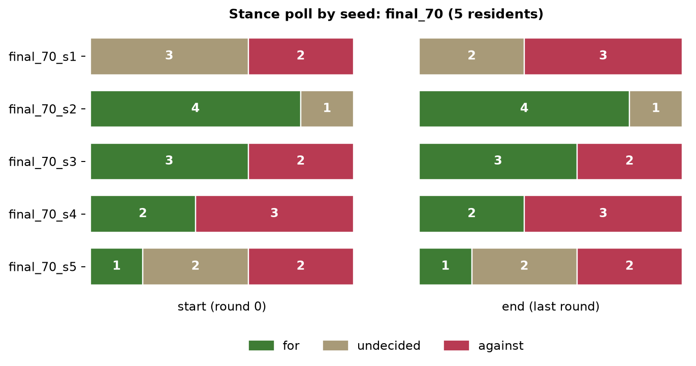

# Spread across seeds: final_70

5 runs of the same town (Linden, 5 residents, 3 rounds); personas and the stance prior are drawn per seed, so the town differs from run to run. Stance poll shown as for / undecided / against.

| run | start | end | mean stance at end | events |
| --- | --- | --- | --- | --- |
| final_70_s1 | 0/3/2 | 0/2/3 | -0.19 | 34 |
| final_70_s2 | 4/1/0 | 4/1/0 | +0.47 | 32 |
| final_70_s3 | 3/0/2 | 3/0/2 | +0.05 | 34 |
| final_70_s4 | 2/0/3 | 2/0/3 | +0.13 | 33 |
| final_70_s5 | 1/2/2 | 1/2/2 | -0.13 | 32 |

Share *for* at the end: mean 0.40, range 0.00–0.80; share *against*: mean 0.40, range 0.00–0.60. The range, not the mean, is the honest summary: one run says little.

