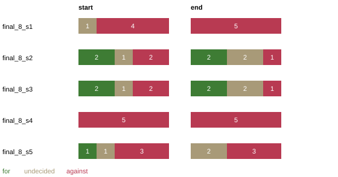

# Spread across seeds: final_8

5 runs of the same town (Linden, 5 residents, 3 rounds); personas and the stance prior are drawn per seed, so the town differs from run to run. Stance poll shown as for / undecided / against.

| run | start | end | mean stance at end | events |
| --- | --- | --- | --- | --- |
| final_8_s1 | 0/1/4 | 0/0/5 | -0.35 | 30 |
| final_8_s2 | 2/1/2 | 2/2/1 | +0.19 | 29 |
| final_8_s3 | 2/1/2 | 2/2/1 | +0.06 | 33 |
| final_8_s4 | 0/0/5 | 0/0/5 | -0.51 | 31 |
| final_8_s5 | 1/1/3 | 0/2/3 | -0.39 | 35 |

Share *for* at the end: mean 0.16, range 0.00–0.40; share *against*: mean 0.60, range 0.20–1.00. The range, not the mean, is the honest summary: one run says little.

